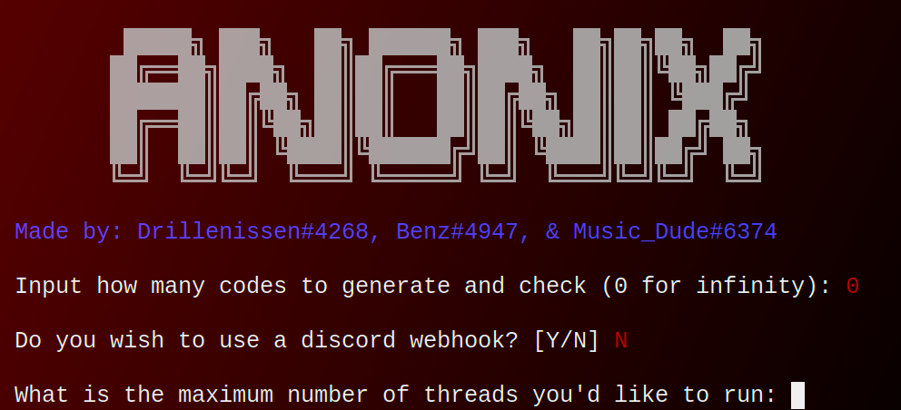

<p align="center">


</p>
<br />
<p align="center">
  <a href="https://github.com/othneildrew/Best-README-Template">
    
  </a>
  
  <h3 align="center">Discord Nitro Generator and Checker</h3>

  <p align="center">
    A discord nitro generator and checker for all your nitro needs
    <br />
    <a href="https://github.com/logicguy1/Discord-Nitro-Generator-and-Checker"><strong>Explore the docs »</strong></a>
    <br />
    <br />
    <a href="https://github.com/logicguy1/Discord-Nitro-Generator-and-Checker/issues">Report Bug</a>
    ·
    <a href="https://github.com/logicguy1/Discord-Nitro-Generator-and-Checker/issues">Request Feature</a>
      ·
    <a href="https://discord.gg/rchHUU9aGk">Join the discord</a>
  </p>
</p>
  
<details open="open">
  <summary>Table of Contents</summary>
  <ol>
    <li>
      <a href="#about-the-project">About The Project</a>
      <ul>
        <li><a href="#built-with">Built With</a></li>
      </ul>
    </li>
    <li>
      <a href="#getting-started">Getting Started</a>
      <ul>
        <li><a href="#prerequisites">Prerequisites</a></li>
        <li><a href="#installation">Installation</a></li>
      </ul>
    </li>
    <li><a href="#usage">Usage</a></li>
    <li><a href="#roadmap">Roadmap</a></li>
    <li><a href="#contributing">Contributing</a></li>
    <li><a href="#copyright">License</a></li>
    <li><a href="#contact">Contact</a></li>
  </ol>
</details>

## About The Project



It generates and checks discord nitro codes at the same time for maximum efficiency

### Built With

* [Requests](https://github.com/psf/requests)
* [Discord webhook](https://github.com/lovvskillz/python-discord-webhook)
* [Colored](https://gitlab.com/dslackw/colored)

## Getting Started

To get a local copy up and running follow these simple steps.

### Prerequisites
You need to install Python, that can be done [here](https://www.python.org)

### Installation
1. Clone the repo
   ```sh
   git clone https://github.com/logicguy1/Discord-Nitro-Generator-and-Checker.git
   ```
2. Install Python packages
   ```sh
   # Windows:
   py -3 -m pip install -r requirements.txt
   
   # Unix
   python3.8 -m pip install -r requirements.txt
   ```
   
#### Or this can be done using android with unrooted Termux
```
git clone https://github.com/logicguy1/Discord-Nitro-Generator-and-Checker
pkg install python
pip install -r requirements.txt
cd Discord-Nitro-Generator-and-Checker
python3 main.py
```
   
## Usage

Run the `main.py` file using `py -3 main.py` 
The code will show you two prompts:
1. How many codes to generate 
2. If you want to use a discord webhook, if you dont know how to get a discord webhook url it is located at   
   ```channel settings » intergrations » webhooks » create webhook```  
   If you dont want to use a webhook simply leave this blank  

The code will start generating and checking after that step

_For more examples, please refer to the [Documentation](https://example.com)_

## Roadmap

See the [open issues](https://github.com/logicguy1/Discord-Nitro-Generator-and-Checker/issues) for a list of proposed features (and known issues).

## Contributing

Contributions are what make the open source community such an amazing place to learn, inspire, and create. Any contributions you make are **greatly appreciated**.

1. Fork the Project
2. Create your Feature Branch (`git checkout -b feature/AmazingFeature`)
3. Commit your Changes (`git commit -m 'Add some AmazingFeature'`)
4. Push to the Branch (`git push origin feature/AmazingFeature`)
5. Open a Pull Request
## Licence

```Copyright © 2021 Drillenissen#4268

Permission is hereby granted, free of charge, to any person obtaining a copy of this software and associated documentation files (the “Software”), to deal in the Software without restriction, including without limitation the rights to use, copy, modify, merge, publish, distribute, sublicense, and/or sell copies of the Software, and to permit persons to whom the Software is furnished to do so, subject to the following conditions:

The above copyright notice and this permission notice shall be included in all copies or substantial portions of the Software.

THE SOFTWARE IS PROVIDED “AS IS”, WITHOUT WARRANTY OF ANY KIND, EXPRESS OR IMPLIED, INCLUDING BUT NOT LIMITED TO THE WARRANTIES OF MERCHANTABILITY, FITNESS FOR A PARTICULAR PURPOSE AND NONINFRINGEMENT. IN NO EVENT SHALL THE AUTHORS OR COPYRIGHT HOLDERS BE LIABLE FOR ANY CLAIM, DAMAGES OR OTHER LIABILITY, WHETHER IN AN ACTION OF CONTRACT, TORT OR OTHERWISE, ARISING FROM, OUT OF OR IN CONNECTION WITH THE SOFTWARE OR THE USE OR OTHER DEALINGS IN THE SOFTWARE.
```
## Contact

Logicguy - [@Drillenissen#4268](https://www.discordapp.com) - logicguy.mailandcontact@gmail.com

Project Link: [https://github.com/logicguy1/Discord-Nitro-Generator-and-Checker](https://github.com/logicguy1/Discord-Nitro-Generator-and-Checker)

<!-- Statistics -->  

<p>

</p>
